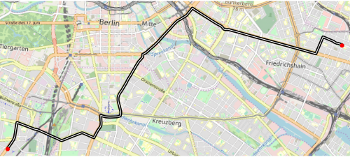
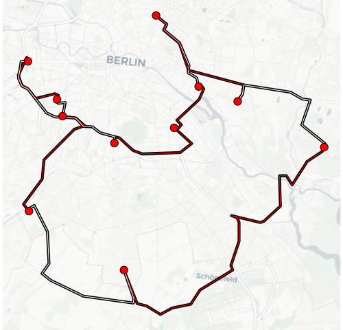

# osrm R package

[](https://CRAN.R-project.org/package=osrm/)

[](https://travis-ci.org/rCarto/osrm)

***Interface Between R and the OpenStreetMap-Based Routing Service [OSRM](http://project-osrm.org/)***


## Description
OSRM is a routing service based on OpenStreetMap data. See <http://project-osrm.org/> for more information. This package allows to compute distances (travel time and kilometric distance) between points and travel time matrices.   

This package relies on the usage of a running OSRM service (tested with v5.18.0 of OSRM).    

You can run your own instance of OSRM following guidelines provided here:    [https://github.com/Project-OSRM/osrm-backend](https://github.com/Project-OSRM/osrm-backend).     
The simplest solution is probably the one based on [docker containers](https://github.com/Project-OSRM/osrm-backend#using-docker).    

To set the OSRM server, use the `osrm.server` option: `options(osrm.server = "http://address.of.the.server/")`.     
To set the profile (driving is set by default), use the `osrm.profile` option: `options(osrm.profile = "name.of.the.profile")`.    


:warning: **You should be careful using the OSRM demo server, it is not always very stable** :bangbang: 


## Features

* `osrmTable` Get travel time matrices between points.

* `osrmRoute` Get the shortest path between two points.

* `osrmTrip` Get the travel geometry between multiple unordered points.

* `osrmIsochrone` Get a SpatialPolygonsDataFrame of isochrones.


## Demo

### `osrmTable`

```r
library(osrm)
# Load data
data("berlin")
# Inputs are data frames
# Travel time matrix
distA <- osrmTable(loc = apotheke.df[1:50, c("id","lon","lat")])
# First 5 rows and columns
distA$durations[1:5,1:5]

```
|           | 440338666| 538057637| 977657079| 3770254015| 364363337|
|:----------|---------:|---------:|---------:|----------:|---------:|
|440338666  |       0.0|      26.2|      45.4|       25.0|      13.8|
|538057637  |      26.8|       0.0|      44.4|       17.1|      20.8|
|977657079  |      45.4|      43.1|       0.0|       37.4|      35.9|
|3770254015 |      28.8|      17.8|      35.0|        0.0|      14.5|
|364363337  |      17.7|      24.7|      34.7|       13.8|       0.0|

### `osrmRoute`

```r
library(osrm)
library(sp)
library(cartography)
# Load data
data("berlin")
route <- osrmRoute(src = c("A", 13.23889, 52.54250),
                   dst = c("B", 13.45363, 52.42926),
                   sp = TRUE, overview = "full")
# Display the path
osm <- getTiles(x = route, crop = TRUE, type = "osm")
tilesLayer(osm)
plot(route, lty = 1,lwd = 4, asp = 1, add=TRUE)
plot(route, lty = 1, lwd = 1, col = "white", add=TRUE)
points(x = c(13.23889, 13.45363), y = c(52.54250,52.42926), 
       col = "red", pch = 20, cex = 1.5)
text(x = c(13.23889, 13.45363), y = c(52.54250,52.42926), 
     labels = c("A","B"), pos = c(1,2))

```



### `osrmTrip`

```r
library(osrm)
library(sp)
library(cartography)
# Load data
data("berlin")
# Get a trip with a SpatialPointsDataFrame
trips <- osrmTrip(loc = apotheke.sp[10:20,])
# Map
osm <- getTiles(x = trips[[1]]$trip, crop = TRUE,
                type = "cartolight", zoom = 11)
tilesLayer(x = osm)
plot(trips[[1]]$trip, col = "black", lwd = 4, add=T)
plot(trips[[1]]$trip, col = c("red", "white"), lwd = 1, add=T)
plot(apotheke.sp[10:20,], pch = 21, bg = "red", cex = 1.5, add=T)

```



### `osrmIsochrone`

```r
library(osrm)
library(sp)
library(cartography)
# Load data
data("berlin")
# Get isochones with a SpatialPointsDataFrame, custom breaks
iso <- osrmIsochrone(loc = apotheke.sp[10,],
                     breaks = seq(from = 0, to = 14, by = 2), res = 50)
# Map
osm <- getTiles(x = iso, crop = FALSE, type = "osm", zoom = 13)
tilesLayer(x = osm)
bks <- sort(c(unique(iso$min), max(iso$max)))
cols <- paste0(carto.pal("turquoise.pal", n1 = length(bks)-1), 80)
choroLayer(spdf = iso,
           var = "center", breaks = bks,
           border = NA, col = cols,
           legend.pos = "topleft",legend.frame = TRUE,
           legend.title.txt = "Isochrones\n(min)",
           add = TRUE)
plot(apotheke.sp[10,], add=TRUE, col ="red", pch = 20)

```


## Installation

* Development version on GitHub
```{r}
require(remotes)
remotes::install_github("rCarto/osrm")
```

* Stable version on [CRAN](https://CRAN.R-project.org/package=osrm/)
```{r}
install.packages("osrm")
```

## Community Guidelines

One can contribute to the package through [pull requests](https://github.com/rCarto/osrm/pulls) and report issues or ask questions [here](https://github.com/rCarto/osrm/issues).
